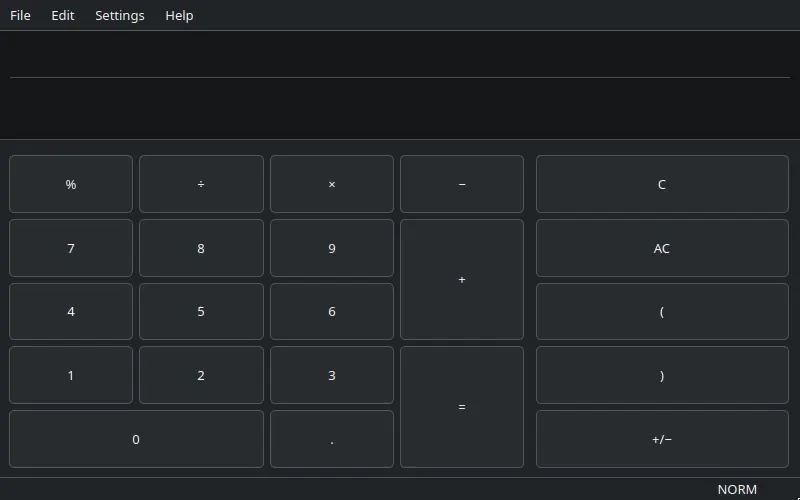

# demoreel

**Record a video of an app running, without filming your desktop.**



Made by demoreel itself, with scripted steps, then turned into this looping
picture with ffmpeg:

```sh
demoreel record -o kcalc.mp4 -d 3 -s 800x500 -r 15 --settle 10 --cursor \
  -a 'wait 1' -a 'click 400 80' -a 'type 1234*5678' -a 'key Return' \
  -a 'wait 1' -a 'type /2' -a 'key Return' -- kcalc
ffmpeg -i kcalc.mp4 -c:v libwebp_anim -q:v 80 -loop 0 readme-demo.webp
```

You give it an app. It gives you back a video file of that app, or one picture
of it, and nothing else — no other windows, no notifications, no magnifier lens
sliding around.

You can run it yourself at a terminal. It is also built to be driven by Claude
Code, so you can ask for a demo video and get one without touching a recording
tool yourself.

## What you get

One `.mp4` file. Just the app, filling the frame. Or, with `demoreel shot`, one
`.png` picture of it — see [Taking a picture](#taking-a-picture). A video can
then be cut, joined to others and given a line of text — see
[Finishing a recording](#finishing-a-recording).

The video is **silent**. There is no sound and there never will be — see
[What it will never do](#what-it-will-never-do). If you need a voiceover or
music, that is a second step in something else.

## Install

demoreel is one Python 3 script. It drives a few common programs, and each
distro below packages all of them.

**1. Install the programs it drives.** One line, for your distro:

```sh
# openSUSE
sudo zypper install ffmpeg xdotool xauth xorg-x11-server-Xvfb
# Debian and Ubuntu
sudo apt install ffmpeg xdotool xauth xvfb
# Fedora
sudo dnf install ffmpeg xdotool xorg-x11-xauth xorg-x11-server-Xvfb
# Arch
sudo pacman -S ffmpeg xdotool xorg-xauth xorg-server-xvfb
```

You also need `python3` and `git`.

**On openSUSE and Fedora, the distro's own ffmpeg cannot write the video.** It
leaves out the H.264 encoder, libx264. Take ffmpeg from Packman on openSUSE,
or from RPM Fusion on Fedora:

```sh
# openSUSE
sudo zypper addrepo -cfp 90 https://ftp.gwdg.de/pub/linux/misc/packman/suse/openSUSE_Tumbleweed/ packman
sudo zypper install --from packman --allow-vendor-change ffmpeg
# Fedora
sudo dnf install https://mirrors.rpmfusion.org/free/fedora/rpmfusion-free-release-$(rpm -E %fedora).noarch.rpm
sudo dnf swap ffmpeg-free ffmpeg --allowerasing
```

zypper asks whether to trust Packman's signing key the first time. Answer
`a`, to trust it always.

**2. Get demoreel, and put it on your PATH.**

```sh
git clone https://github.com/milnet01/demoreel.git
mkdir -p ~/.local/bin
ln -s "$PWD/demoreel/demoreel" ~/.local/bin/demoreel
```

If the shell then says `demoreel: command not found`, `~/.local/bin` is not on
your PATH yet. Add this line to `~/.bashrc` and open a new terminal:

```sh
export PATH="$HOME/.local/bin:$PATH"
```

**3. Check it.**

```sh
demoreel check
```

It records nothing. It says `ready`, or names what is missing and the command
that installs it.

**For apps that need the graphics card**, `--gpu` needs four more programs:

```sh
# openSUSE
sudo zypper install cage xwayland wlr-randr wf-recorder
# Debian and Ubuntu
sudo apt install cage xwayland wlr-randr wf-recorder
# Fedora
sudo dnf install cage xorg-x11-server-Xwayland wlr-randr wf-recorder
# Arch
sudo pacman -S cage xorg-xwayland wlr-randr wf-recorder
```

## Quick start

Run `demoreel` from any folder. Without `-o`, the video lands in the folder you
run it from, named after the app and the time.

```sh
# record Kate for 30 seconds, into a file named after the app
demoreel record -- kate

# choose the filename and how long to record
demoreel record -o demo.mp4 -d 20 -- kate

# watch it, in your usual video player
xdg-open demo.mp4

# show the app being used, not just sitting there
demoreel record -o demo.mp4 -d 20 --cursor \
  -a 'wait 2' -a 'click 400 300' -a 'type hello' -a 'key Return' -- myapp

# record until you say stop, rather than for a set time
demoreel record -o demo.mp4 -d 0 -n mydemo -- myapp &

# ...then, in the same or another terminal:
demoreel stop mydemo
```

`stop` works straight away, even on the very next line of a script. If the run
is still starting up, `stop` waits until it is recording and then stops it, so
you always get a video. `stop` then waits for the video to be finished and
checked, and prints its path. If the run fails,
before it records or after it is stopped, `stop` prints no path and exits with
an error.

**Ctrl+C does the same for a run in the foreground.** Leave off the `&`, press
Ctrl+C when you have enough, and the video is finished, checked and its path
printed, exactly as with `stop`.

Everything after `--` is the command that starts your app, exactly as you would
type it yourself. demoreel knows nothing about any particular app.

When it finishes it prints one line: the path to your video. Nothing else goes
on that line, so you can safely capture it in a script. Anything the app itself
prints goes to the terminal separately, or to a file with `--app-log`.

At a terminal you also see how long is left, or on a `-d 0` run how long it has
been going, on one line that updates in place. It ends with the video's length
and size. None of this is printed when the output goes to a script or a file.

## Taking a picture

```sh
# one picture of Kate, into a file named after the app
demoreel shot -- kate

# choose the filename, and click something first
demoreel shot -o menu.png -a 'click 40 12' -- myapp
```

`shot` uses the same private screen as `record`, and sizes the window the same
way. It waits for the app to draw, for up to `--settle` seconds — 10 unless you
say otherwise. Then it runs your `-a` steps, saves one `.png`, closes the app,
and prints the path. For three pictures, run it three times.

It takes the options `record` takes, less the ones about time: no `-d`, no `-r`,
and no `-n`. There is nothing to `stop`, so a `shot` has no name. It keeps its
private screen's files in a folder of its own, removed when it succeeds and kept
when it fails, like the logs below, and writes nothing `stop` reads — so it can run beside recordings and other shots. The one
thing they can share is the default filename, the app and the time to the
second, so give simultaneous shots of one app their own `-o`. The size need not
be even; that rule belongs to video.

The picture is always checked, even if the app has closed itself: an app that
has gone leaves only an empty screen. A picture that is one flat colour fails
the run, and so does not being able to look at the screen at all. A failed run
prints no path, and keeps any picture it had saved.

## Finishing a recording

A recording is rarely what you publish. `demoreel edit` takes a short script,
a list of scenes in plain words, and makes the finished film from it.
Shortcuts do the one-step jobs without a script, and `motion` and `poster`
look at a video without changing it.

Each of these works on video files, not on an app. So it starts no private
screen, takes no `-n` name, and can run beside recordings.

```sh
# see where the picture stops changing in each clip
demoreel motion intro.mp4

# make the film: a script on standard input, one scene per line
demoreel edit - -o film.mp4 <<'EOF'
clip intro.mp4 from 2 to 29.8 fade-in 1
  text "Opening a file" from 3 to 6

card 3
  text "Saving a file"

clip save.mp4
  text "Now it saves" from 8 to 12

card 6.9 spin.png crossfade 0.5 fade-out 1
  text "The saved file"
EOF

# the still picture a website shows before the film plays
demoreel poster film.mp4 -t 14.9 -o poster.jpg
```

What they share:

- **`-o` is required by every command that writes a file**, and it may not be
  one of the files being read. A command never writes over its own input.
- **Every command that writes a video writes a silent H.264 `.mp4` with its
  index at the front**, and `-o` must end in `.mp4`; any other ending is
  refused. So one command's output can be another's input. Sound in an input
  is dropped.
- **stdout carries the finished path and nothing else**, as with `record`.
  `motion` writes no file, so its report is what it prints there. Everything
  else these commands say goes to stderr.
- **Times are in seconds and may have a fraction**: `29.8`. A time in a clip is
  counted from the start of that clip's own file, so the numbers `motion`
  prints can be used as they are. `motion` prints a time to a thousandth of a
  second, so wherever a time picks a frame, one within half a thousandth
  before a frame's start means that frame. A time past the end of the file is
  an error, not a guess.
- **Everything is checked before anything is made.** A mistake in the last
  line of a script stops the run at once, and the message names the line.
- **A command that fails leaves nothing at `-o`.** A file already there is
  left as it was.
- **The picture is encoded again each time a video is written, and each encode
  loses a little.** `edit` encodes once however many scenes the film has,
  which is the reason to use it for anything more than one step.
- **They need `ffmpeg` and nothing new**, and read any video it can read.
  Text also needs an `ffmpeg` built to draw text, and a font on the machine.
  `demoreel check` draws a line of text to find out, and reports the finishing
  commands and their text on lines of their own. Those lines
  never change its exit status, which still says only whether the default
  backend can record.

### `edit`: a film from a script

```sh
demoreel edit film.txt -o film.mp4
```

The script is a text file, or `-` to read it from standard input. Each line is
one scene, played in the order written. A blank line, or a line starting with
`#`, is ignored. A `#` anywhere else is an ordinary character. A file named in a script is looked for from the folder you run
demoreel in. A line is split into words the way a shell splits one: a name or
a text with a space in it goes in single or double quotes, and inside double
quotes `\"` is a quote mark.

**`clip FILE`** plays a video. After the file name, any of these, in any
order:

- `from 2` and `to 29.8` — keep only that part. Leave one out and that end
  stays where it is. The frame on screen at `from` is the first one kept, and
  the frame on screen at `to` is the last one kept. So `to` set to the `last
  change` that `motion` prints ends the scene on the last new picture. A `to`
  equal to the file's length, as `motion` prints it, is accepted and means the
  last frame.
- `fade-in 1` — the scene starts black and the picture arrives over a second.
- `fade-out 1` — the picture goes to black over the scene's last second.
- `fade-at 12` — a fade between two scenes inside one recording. The picture
  goes to black just before that moment and comes back just after. Nothing is
  cut and the scene keeps its length. It may be given more than once. Each half
  takes `fade-length` seconds, half a second unless the line says otherwise.
  You name the moment; demoreel does not guess where a scene changes.
- `crossfade 0.5` — fade from the scene before into this one, over half a
  second, where a plain cut would otherwise be. The two scenes overlap for that
  long, so the film is that much shorter than its scenes added together. A
  scene takes a crossfade or a fade-in, not both, and the first scene takes
  no crossfade.

Nothing takes a piece out of the middle of a clip. To skip a part, use the clip
twice, with a different `from` and `to` each time.

**`card SECONDS`** shows a plain background for that long. It may carry a
picture, text, or both.

- A file name after the seconds puts that picture on the card:
  `card 6.9 spin.png`. It is scaled to fit and centred, never stretched and
  never enlarged. A see-through picture shows the background through it. An
  animated picture (`.gif`, or an animated `.png`) plays at its own speed and
  starts again when it ends, until the card is over. It is held in memory to
  do that, so a very large animation is refused: make it a video and use it as
  a clip.
- `background #202830` sets the colour, written `#RRGGBB`. Without it the
  background is `#101418`.
- `fade-in`, `fade-out` and `crossfade` work as on a clip.

**`text "WORDS"`** puts one line of text on the scene above it. Indent it if
you like; the indent is only for your eyes.

- On a clip, the text sits on a dark band across the bottom of the picture, so
  it reads over anything. It is bold and white, and its height is 5% of the
  frame's.
- On a card, the text is the card's title: bold, near the top when the card
  has a picture and in the middle when it has none. Its height is 7% of the
  frame's. Without a band it is white on a dark background and near-black on
  a light one.
- `from 3` and `to 6` say when it shows. On a clip these are times in the
  clip's own file, like the clip's `from` and `to`; on a card they count from
  the card's start. Left out, the text stays for the whole scene.
- `size 4` sets another height, as a percentage of the frame's.
- `font "DejaVu Serif"` draws it in that font family, by the name `fc-list`
  gives it, in the family's regular face and not in bold. Anything after a
  colon is handed to `fc-match` as written, so `font "DejaVu Serif:bold"`
  asks for the family's bold. A family the machine does not have is refused,
  never swapped for another, and so is a general name like `serif`, which is
  no family's name. A face the family does not have, a bold where it has only
  a regular, is drawn in the nearest face it has. A value with a `/` in it is a font file and is used as it is.
- `colour #FFD040` sets the text's colour, written `#RRGGBB`.
- `outline #000000` draws a line of that colour round each letter, and
  `shadow #000000` a shadow of that colour below and to the right of it. How
  thick the line is, and how far off the shadow, follow the text's height.
- `fade-in 0.5` brings the text in over half a second from its `from`, and
  `fade-out 0.5` takes it away over the half second before its `to`. The two
  together may not be longer than the text shows. Its band fades with it,
  which needs an ffmpeg whose text filter can size its own box (`boxw` in
  `ffmpeg -h filter=drawtext`). On one that cannot, a text that fades with
  its band on is refused.
- `band off` takes the dark band away, and `band on` gives a card's text one.
  Text on a band is white unless `colour` says otherwise.
- `at top`, `at middle` or `at bottom` says where it sits. With a band, the
  band runs across the frame there, against the edge at the top or bottom.
  Without one, the text sits a twentieth of the frame's height in from that
  edge. On a card, the picture is fitted into the room left between a text at
  the top and a text at the bottom, and a text in the middle lies over it.
- Text wider than the frame less a twentieth of its width at each side is
  refused, its outline counted.
  Nothing is shrunk without you asking. Unless the line names a font, it is
  the machine's own bold sans, so a line that
  only just fits on one machine may be refused on another. It is found with
  `fc-match`; on a machine without that program the text is drawn in the
  regular weight, and a font asked for by name is refused.
- A scene may have several texts, but only one on screen at a time: two whose
  times overlap are refused. A text shows from its `from` up to its `to` and
  not on the frame at `to`, so one may start at the time another ends.

**The film's picture size and frame rate** are the first clip's. `-s` and
`-r` set them by hand. A film with no clip in it, cards only, is 1600x1000 at
30 unless you say, as `record` is. Every other clip is scaled to the film's
size and brought to its frame rate. A clip whose shape differs from the
film's, wider or taller, is refused rather than stretched.

As it starts, `edit` prints the plan on stderr: each scene, and when it starts
and ends in the finished film.

### The shortcuts

Each is one scene, or one kind of scene, without writing a script. They take
the script's words as options and do exactly what the script would.

```sh
# cut the ends off: one clip, with from and to
demoreel trim demo.mp4 -o short.mp4 --from 2 --to 29.8

# text over part of a video: one clip, with its texts
demoreel caption demo.mp4 -o out.mp4 --text 'Opening a file' --from 2 --to 6 \
  --text 'Saving it' --from 8 --to 12

# clips end to end: one clip scene each
demoreel join intro.mp4 demo.mp4 outro.mp4 -o final.mp4 --crossfade 0.5

# one card, the size of the recording it will sit beside
demoreel card -o title.mp4 -d 3 --like demo.mp4 --text 'Saving a file'
```

- `trim` takes `--from`, `--to`, `--fade-in`, `--fade-out`, `--fade-at` and
  `--fade-length`. With only a fade it adds the fade and cuts nothing.
- `caption` takes one or more `--text`. A `--from`, `--to` or `--text-size`
  belongs to the `--text` before it, and one given before the first `--text`
  is refused: `caption` never cuts the video. It also takes `--fade-in` and
  `--fade-out`.
- `join` takes two or more videos. `--crossfade` applies at every join;
  without it each join is a plain cut. `--fade-in` is for the first clip and
  `--fade-out` for the last.
- `card` takes `-d` for its length, which is required. A picture is given as
  a bare file name, as in the script: `demoreel card -o spin.mp4 -d 6.9
  spin.png`. It also takes `--text`, `--text-size`, `--background`,
  `--fade-in` and `--fade-out`. Its size and
  frame rate come from `--like FILE`; `-s` and `-r` set them by hand and win
  over `--like`. With none of them it is 1600x1000 at 30.

A text's `font`, `colour`, `outline`, `shadow`, `band`, `at` and its own fades
are the script's alone. A shortcut sets a text's words, times and size.

Chaining shortcuts encodes the picture once per step. For more than one step,
write the script.

### `motion`: how smooth is it, and where does it stand still

```sh
demoreel motion demo.mp4
demoreel motion demo.mp4 --from 30 --to 37 --still 0.7
```

Reads the video and changes nothing. A frame counts as new when the picture has
changed since the last new frame. The test is set to ignore the encoder's own
sharpening of a picture after it changes, so a stuttering video cannot pass as
smooth. Its cost: very faint, slow movement, such as a gradient drifting a
little each frame, is counted only as it adds up. Movement with edges in it,
like text, a pointer or a moving window, is counted frame by frame. The
report:

```
duration: 37.500
frames: 1125
new frames: 412
new frames per second: 10.99
last change: 29.800
still: 12.300 to 16.800 (4.500)
still: 29.800 to 37.500 (7.700)
```

- `duration` — seconds of video looked at.
- `frames` — how many frames that is.
- `new frames` — how many of them are new by that test.
- `new frames per second` — the figure that says whether it is smooth. A file
  can be stored at 30 frames a second and show three new ones.
- `last change` — the time of the last new frame. That is where to cut: a
  clip's `to` keeps the frame at that time.
- `still` — one line for each stretch with no change longer than `--still`
  seconds (1 unless you say). Its start is the time of the last new frame
  before it, its end is the time of the next new frame, or the end of the
  video, and its length is in brackets. No such stretch, no such line.

`--from` and `--to` look at part of the video; the times printed are still
times in the file. `--json` prints the same report as one JSON object, for a
script:

```json
{"duration": 37.5, "frames": 1125, "new_frames": 412,
 "new_frames_per_second": 10.99, "last_change": 29.8,
 "still": [{"from": 12.3, "to": 16.8, "seconds": 4.5},
           {"from": 29.8, "to": 37.5, "seconds": 7.7}]}
```

`motion` never fails a video and never cuts one. Cutting out a still stretch
would hide a real wait, so that stays your decision.

### `poster`: one frame as a picture

```sh
demoreel poster demo.mp4 -t 14.9 -o poster.jpg
```

Saves the frame on screen at `-t`, or `--time`, as a picture. `-t` is
required. `-o` ends in `.png` or `.jpg`. `shot` photographs an app; `poster` photographs the video, so the
picture is a frame of the very file you publish.

## How it avoids filming your desktop

This is the whole idea, so it is worth a minute.

The obvious approach is to record the screen. That is the wrong approach here,
for two reasons found the hard way.

**It films everything you have open.** Whatever else is on screen, private or
not, ends up in a file that may go on a public pull request.

**It films your accessibility tools.** This machine runs KDE's Magnifier, a lens
that follows the pointer. It is painted onto the screen itself, so any screen
recording catches it. Turning it off is not an option — it is what makes the
screen readable, so without it the app cannot be driven for the recording at
all.

Recording a single window would dodge both, because it reads that window
directly rather than the screen. But the recorder has to *ask* the desktop for a
window, and Kooha 2.3.2 does not: it only offers whole screen, virtual screen or
a region. OBS does ask, but clicking through OBS by hand defeats the point of
having Claude Code make the recording.

So demoreel does something different. It builds a **second, invisible screen**
that exists only for this recording — with no desktop on it, no notifications
and no magnifier — starts your app there, and films that. Nothing of your real
session can be in the picture, because your real session is not on that screen.

Other people on the machine cannot look at that screen either. It is locked with
a one-off password (an "auth cookie") that this run holds in a file only you can
read, so a program running as somebody else is refused. It is not a wall against
your own programs: anything running as you can read that file.

### What happens, step by step

1. Create the private screen at the size you asked for.
2. Start your app on it.
3. Wait for the app's window, then resize it to fill the frame.
4. Optionally run your scripted steps — click, type, wait — while recording.
5. Record for the duration you asked for. Halfway through, look at the private
   screen once. If it is still a single flat colour, at least half the video
   is empty, so the run stops there and fails as step 6 describes.
6. Look at the private screen one last time. If the app is still running and
   the screen is a single flat colour, that is an error, not a video — the run
   stops and prints no path, leaving the part-written file on disk. Both looks
   are skipped if the app closed itself first: it left an empty screen behind,
   and that recording is fine. With `-d 0` there is no halfway point, so only
   this last look happens. If demoreel cannot look at the screen at all,
   that is an error too, with the same result: it cannot vouch for the video,
   so it does not hand it back.
7. Close the app, remove the private screen, leave one video file behind.

Step 6 matters more than it sounds. A recording of nothing is still a perfectly
valid video file that opens, plays, and reports success — so without that check
you would only find out by watching it.

## The options

| Option | What it does |
|---|---|
| `-o`, `--output` | Where to write the video. Without it, the file lands in the current folder, named after the app and the time. |
| `-d`, `--duration` | How many seconds to record, counted from when the scripted steps finish — so a run with `-a` steps lasts longer than this. `-d 0` means "keep going until I say stop, or until the app closes itself, whichever comes first". |
| `-s`, `--size` | The size of the picture, like `1280x800`. Both numbers must be even. |
| `-r`, `--framerate` | Frames per second. |
| `-n`, `--name` | A name for this run, so `demoreel stop` knows which one you mean. |
| `-a`, `--action` | A scripted step. Repeat it; they run in order. |
| `--steps` | Read the scripted steps from a file, one per line, or from standard input with `--steps -`. Use it instead of `-a` when a step types something private. |
| `--cursor` | Draw the mouse pointer. Off by default, because with no scripted clicks it just sits in the corner. Not available with `record --gpu`. |
| `--app-log` | Save what the app printed to a file. |
| `--settle` | Wait for the app to draw something before starting to record. |
| `--gpu` | For apps that need the graphics card. |
| `--startup-timeout` | How long to wait for the app's window to appear. |

### Scripted steps

`-a` takes one step at a time, and they run in the order you write them, while
the recording is going:

- `wait 2` — pause for two seconds
- `move 400 300` — move the pointer
- `click 400 300` — click there, or just `click` where it already is. The
  pointer starts in the bottom-right corner, so it lights up nothing before
  your first step.
- `type hello there` — type some text. Everything after `type` and one space is
  typed exactly as written, quotes and spaces included. Only your own shell's
  quoting around the whole step is removed.
- `key Return` — press a key
- `hold w 3` — hold a key down for three seconds, for an app that moves while
  a key is held. It is let go however the step ends, a stop included.

**Typing something private? Use `--steps`, not `-a`.** Anything you put on the
command line can be read by other people using that computer, for as long as the
command runs. `--steps` reads the same steps from a file, or from standard input
with `--steps -`, so they never appear there. One step per line; a blank line
and a line starting with `#` are skipped. It cannot be mixed with `-a`.

```bash
printf 'wait 2\ntype my secret\nkey Return\n' | demoreel record --steps - -- kate
```

That keeps the text out of demoreel's command line. The shell line above still
holds it, so for a real secret put the steps in a file only you can read.

### Running two recordings at once

That is fine, as long as you give them different names with `-n`. They pick
separate private screens on their own; you never have to think about that part.

Names are the part you do have to think about. Two runs with the same name
cannot record at once: the second one refuses and exits with an error, even if
both start at the same instant. So give concurrent runs different `-n` names.

### `--app-log`: keeping what the app said

Worth using when the app itself tells you whether it drew the *right* thing.

demoreel can tell that *something* was recorded. It cannot tell that an app
quietly fell back to low-detail graphics — that recording is not blank, does not
error, and passes every check here. If your app prints a line proving it loaded
the real thing, keep the log and check it.

Your `--app-log` file is yours: demoreel never removes it. Its own internal
logs, from the recorder and the display, are separate — kept when a run fails so
there is something to read, and removed when it succeeds.

### `--settle`: skipping a black startup screen

Some apps, especially graphics-heavy ones, sit on a black screen for several
seconds while they warm up. Without this you record that black screen and have
to `trim` it off afterwards, which costs a second encode.

`--settle 20` waits up to twenty seconds for the screen to stop being one flat
colour, then starts recording. If nothing is drawn in that time it says so and
records anyway, leaving the end-of-run check to fail it — subject to the same
exception as step 6, so an app that closes itself still succeeds. If it cannot
look at the screen at all, it stops the run there rather than waiting blind.

It is the same test as the blank check at the end of a run, used as a gate
rather than as a verdict. That is deliberate: one definition of "nothing is on
this screen".

Its honest limit: it waits for *any* change in the picture, not for the app to
be ready. An app that paints a cursor or a border over its black startup screen
counts as drawn. A real `xterm` measures 97.7% uniform, well under the 99.9%
bar, so it is built for a startup screen that is genuinely blank.

### The manual page

`demoreel.1` is the reference: every command, option and step, the exit
statuses, and the files a run keeps. Read it in place with `man ./demoreel.1`.

### Tab completion

`completions/` has scripts for bash, zsh and fish. They complete the
subcommands, every option, the step names after `-a`, and, after
`demoreel stop`, the names of the recordings still running. Everything after
`--` is completed as the app's own command line. To turn them on:

```sh
# bash: add this line to ~/.bashrc
source /path/to/demoreel/completions/demoreel.bash

# zsh: add this line to ~/.zshrc, before compinit runs
fpath=(/path/to/demoreel/completions $fpath)

# fish: run this once
ln -s /path/to/demoreel/completions/demoreel.fish ~/.config/fish/completions/
```

## Apps that need the graphics card

Some apps — 3D, games, anything using OpenGL or Vulkan — cannot draw at all on
the ordinary private screen, because it has no graphics card behind it. You get
a black recording, which demoreel refuses to hand back as long as the app is
still running when the recording ends.

For those, add `--gpu`:

```sh
demoreel record -o demo.mp4 -d 20 -s 1280x800 --gpu -- vkcube
```

This swaps in a different kind of private screen, one that can reach the real
graphics card. Everything else is the same: same sizing, same scripted steps,
same single file out. Privacy is unchanged — it is still a screen of its own,
started fresh for this run, with nothing of your session on it.

The ordinary screen stays the default, because it is lighter and most apps do
not need the card. `--gpu` needs `cage`, `Xwayland`, `wlr-randr` and `xauth`
installed, and `record --gpu` needs `wf-recorder` too; demoreel says so plainly
if any is missing.

**`--gpu` records from the compositor, not from the X screen.** The private
screen is an X screen (`Xwayland`) shown by a small compositor (`cage`). While a
3D app keeps the card busy, the X side's copy of the picture is refreshed only a
few times a second. The compositor's copy is not. So `--gpu` records with
`wf-recorder`, which reads the compositor's copy. Measured on the same 3D app
over the same run: every frame new from the compositor, about one in four from
the X side.

After a `--gpu` run, demoreel still checks how often the middle of the video
changed, and prints a note when it is rarely. A still app repeats frames too, so
the note says "if the app was moving".

**`record --gpu` refuses `--cursor`.** The compositor's copy of the picture
never has the pointer in it, so the option cannot be honoured. demoreel says so
before recording.

`demoreel shot --gpu` still takes its picture from the X screen, so its
`--cursor` still works. One still picture shows no stutter.

The blank check still looks at the X screen. On `record --gpu` that is not
where the video comes from, so demoreel also checks the finished video, at the
same moments as its two looks at the screen and skipped in the same cases. A
flat frame there fails the run as a blank screen does.

## Recording a Flatpak app

A Flatpak needs three extra flags on **its own** command line:

```sh
demoreel record -o demo.mp4 -d 20 -- \
  flatpak run --socket=x11 --nosocket=wayland --filesystem=/tmp/.X11-unix \
  io.github.milnet01.finbreak
```

If you leave one out, demoreel tells you which one before it starts recording,
rather than handing you a blank video afterwards.

Why they are needed, briefly. A Flatpak runs in a sandbox and cannot see the
private screen unless it is told to. `--socket=x11` and
`--filesystem=/tmp/.X11-unix` are what let it through. `--nosocket=wayland` is
the one people miss: given the choice, the app prefers the other display system
and ignores the private screen entirely, so this removes the choice.

It is a warning rather than a refusal, because an app that never offered that
choice does not need `--nosocket=wayland`, and knowing which is which would mean
knowing each app.

You may see `QT_QPA_PLATFORM=xcb` suggested instead. Prefer the flags above.
That setting only works for Qt apps, so a GTK app ignores it — and relying on it
would mean knowing each app's toolkit, which is exactly the per-app knowledge
this tool refuses to carry. It is also unreliable between Flatpak versions: OBS
issue #11847 reports it working on 30.2.3 and failing on 31.0.1, closed as *not
planned*.

This is the case the whole tool was built for. Flathub wants to see the Flatpak
running, not a source checkout.

**An ordinary, non-Flatpak app needs the same nudge, and demoreel does it for
you** — no flags, nothing to remember. It applies to every target that is not
sandboxed away from its environment.

## Any Claude Code session must be able to drive it

This is a machine-wide tool, not part of any one project. **Any Claude Code
session, working in any project, must be able to record with it** — that is why
it lives in its own directory rather than inside the app that first needed it.

Four requirements follow, and they are requirements rather than preferences:

- **Callable from anywhere.** It works regardless of which folder you are in,
  and nothing about any particular app is built in; the caller passes the
  command to run.
- **Discoverable without being told.** A session that has never heard of this
  tool still has to find it. The `record-demo` skill does that job: it is
  machine-wide, so a request to record an app routes here on its own.
- **Safe to run at the same time as itself.** Two sessions may record at the
  same moment and neither should know about the other. So the private screen is
  *found*, never fixed — a hardcoded one is a collision waiting to happen, where
  the second run either fails or, worse, quietly records the first run's app.
  The screen has to report its own number back (that is what `Xvfb -displayfd`
  does, and `Xwayland -displayfd` on `--gpu`). Scanning for a free number
  is not a substitute: between finding one free and claiming it, another run can
  take it. The `--gpu` compositor's own connection name is found the same way:
  the compositor picks it, and demoreel reads back the name it picked.
  Everything a recording writes is keyed to its name, so simultaneous
  recordings need different `-n` values.
- **Never asks you anything.** No prompts, no dialogs, no "pick a window" step.
  A session runs it, waits, and gets a file. Anything needing a human click is a
  design error here — that is exactly what made the existing tools unusable.

It also cleans up after every run, including failures. A leftover private screen
holds its slot and slowly spoils the pool for later sessions.

## What it will never do

**This is a small tool and it stays a small tool.** The temptation is to grow it
into a general recording suite. If a job needs more than "record this app doing
these few things, and make that recording fit to publish", that job wants OBS
and a video editor.

Permanently out of scope:

- No audio, webcam or cursor highlighting.

  **The file demoreel hands back is silent, and it will stay that way.** Worth
  saying outright, because `-d 20` looks like it produces something you could
  put straight on a website and it does not: a trailer with sound needs a second
  step elsewhere. That is the accepted cost of the tool staying this size.
  Capturing the app's own audio would mean a private sound channel per run, a
  second recorder and a merge at the end — a coherent design, and still a no.

- No editing beyond [Finishing a recording](#finishing-a-recording). demoreel
  may cut the ends off a video, measure it, take a frame from it, play scenes
  one after another, show a picture, still or animated, on a card between
  them, put one line of text on or between them, styled as the script says,
  and fade. That is the whole
  list. A script is a list of scenes in order and nothing more: no
  layers, no two pictures on screen at once, no transition other than a fade,
  no zoom, no text that moves, no speeding up or slowing down. Nothing is ever
  removed from a video automatically.
- No graphical interface, no background service, no config file — options go on
  the command line. An `edit` script describes one film, and a `--steps` file lists
  scripted steps; neither holds settings for demoreel, and neither is read
  unless you name it.
- No plugins, no per-app profiles.
- No third kind of private screen. The ordinary one covers ordinary apps and
  `--gpu` covers the ones needing the card. The second was added because the
  first demonstrably could not do the job for Vulkan, not because more choices
  are interesting.
- No recording of your real screen. That is the entire thing it exists to avoid,
  and adding it back would make every other decision here pointless.

The test is that list, not how long the file is. A change earns its place if it
makes "record this app doing these few things" work somewhere it did not. A
single picture is the same job, stopped at one frame, which is why `shot` is
here. The finishing commands are here because every video made for a website
needed the same few steps afterwards, typed by hand each time. A new one earns
its place only if it is on the list above.

## Things that catch you out

**An app that only allows one copy at a time will not start here.** If a copy is
already running on your real desktop, the new one hands over to it and exits
successfully — so demoreel sees a healthy process that never showed a window.
finbreak does exactly this (FIBR-0204). Close the running copy first. The error
message says so, rather than looking like a demoreel bug. An app that keeps its
one-copy lock under its XDG folders can run beside your copy instead: point
those folders at a temporary one on the app's own command line. finbreak's lock
lives there.

**Recording with fresh settings can make a KDE or Qt app unreadable.** Pointing
`XDG_CONFIG_HOME` at an empty folder keeps your own settings out of the video,
but the app then gets a dark window with dark text. Copy your colour scheme into
that folder first, and the app draws normally:

    mkdir -p /tmp/cfg && cp ~/.config/kdeglobals /tmp/cfg/
    demoreel record -o demo.mp4 -- env XDG_CONFIG_HOME=/tmp/cfg myapp

Checked with `kcalc`: an empty folder gave labels too dark to read, and the
copied `kdeglobals` fixed them.

**A Qt app may print `Failed to create wl_display`.** That is expected. demoreel
points the app at a Wayland display that does not exist, so it uses the private
screen instead of your real one.

**Nothing manages windows on the private screen.** None is needed to record one
app, and adding one is a dependency for no gain — the single window already has
focus, so demoreel does not try to give it any. An app whose dialogs need
arranging may misbehave; if that ever comes up the answer is a minimal window
manager, not more code here.

**An app that cannot use the older display system at all will not work.** Both
kinds of private screen rely on it. This is the honest limit of the design, not
a bug to fix.

**demoreel picks the biggest window on the private screen**, out of the ones
that have a name. Size is what separates a real window from a startup dialog
without knowing anything about the app — pick by search order instead and you
get the dialog about half the time, stretched to fill the frame while the real
window sits behind it.

**An app that names no window at all is not found.** demoreel says so after
waiting, and records anyway, so you get the app at its own size
rather than filling the frame. Nothing is lost but the sizing.

**An app that sets its own size after demoreel has sized it is warned about,
not stopped.** demoreel sizes the window once, before recording. An app that
then picks another size records cropped, or with an empty band beside it. The
warning names the size the app chose; record again with `-s` set to it.

## Constraints already verified on this machine

Checked by running them, not assumed. This section is for maintainers.

- `Xvfb`, `xauth`, `xdotool`, `wmctrl` and `ffmpeg` are installed. `xvfb-run`
  is not.
- `Xvfb :99 -screen 0 1600x1000x24` starts, and `xdotool getdisplaygeometry`
  against it returns `1600 1000`. The virtual display works.
- X11 automation is reliable *inside* Xvfb. The usual warning that `xdotool`
  hangs or silently fails under Wayland applies to the user's real session, not
  to a virtual X display, where every client is an X client.
- Unsetting `WAYLAND_DISPLAY` does **not** keep a client off the real
  compositor. Measured with GTK4 on this Wayland session: with the variable
  inherited, no window on `Xvfb`; with it unset, still no window on `Xvfb`;
  with it set to a name that cannot resolve, the window appears. `Xvfb` records
  black in the first two cases and the run otherwise looks entirely successful.
  This is why demoreel sets that variable to a name that cannot exist rather
  than clearing it.
- A blank frame is measurable, and the margin is wide. On an empty 1280x800
  `Xvfb`, 99.994% of the frame is one grey level; a window only 200x100 brings
  that to 98%. Refusing above 99.9% separates the two without a threshold that
  needs tuning.
- `Xwayland` on a headless `cage` reaches the real GPU: `glxinfo` inside it
  reports `AMD Radeon RX 6600 (radeonsi)` rather than `llvmpipe`, and `vkcube`
  selects the discrete card through the `xcb` surface. `weston`'s headless
  backend was tried and falls back to software here (`Failed to initialize
  glamor`), so `cage` is not an arbitrary pick between the two.
- **The `--gpu` size must be set twice, and in order.** `cage`'s headless
  screen starts at 1280x720, and a full-screen `Xwayland` is scaled into it.
  `wlr-randr` resizes `cage`'s screen, but an `Xwayland` already running keeps
  its first size: resized to 1920x1080, a full-frame window filled only the
  top-left 1280x720. So demoreel resizes `cage`'s screen first, then starts
  `Xwayland` with the same size. Measured that way at 1600x900: a full-frame
  window covered the whole recorded frame, unscaled. `xwfb-run` starts `cage`
  and `Xwayland` together, with no step between, which is why demoreel no longer
  uses it.
- **The compositor's copy of the picture sees every frame; the X side's does
  not.** On a busy 3D app over the same 12 seconds, `wf-recorder` on `cage`
  captured 643 frames, all different. `x11grab` on the X side captured 588, of
  which 156 differed from the one before. The app was drawing about 54 frames a
  second throughout.
- **No one threshold for "the picture changed" serves both `motion` and the
  `--gpu` note.** x264 improves a picture over the frames after it changes.
  Measured 2026-09-30 on patterns with a known number of new frames, encoded
  as the recorder encodes, counting any 8x8 block that moved by more than the
  threshold: 9 new frames in 90 scored 44 at 256 and 9 at 640, and 36 in 360
  scored 167 and 36. A gradient drifting a little each frame, new in all 360,
  scored 360 at 256 and 145 at 640. A moving pattern with edges scored 60 of 60
  at both. So `motion` uses 640, where a stuttering video cannot pass as
  smooth, and the `--gpu` note keeps 256, where that gradient does not read as
  stutter.
- **An input that never ends fills the memory.** While the finishing commands
  were built, an animated `.png` read with ffmpeg's own looping, behind
  another scene, took ffmpeg to 14 GB in six minutes. Every stream in a film is
  now cut to its own number of frames, pictures repeat inside the filter graph
  where a frame is made only when wanted, and the ffmpeg that makes a film may
  take at most half the machine's memory, or 4 GB where that is more.
- **`wf-recorder` draws no pointer.** With the pointer moved over the app, none
  of the 39 frames of a recording showed it; `x11grab` on the same X screen drew
  it at that spot. `wf-recorder` has no option to draw one.
- **The private display is private to this run, and that is enforced rather
  than assumed.** Both backends put an `MIT-MAGIC-COOKIE-1` cookie on the
  display. Measured before the cookie existed: a local client with no
  credential read the geometry and grabbed a frame of what was on screen.
  Measured after: the same client is refused, and one holding the run's cookie
  still works. File permissions on the socket are not an alternative — `Xvfb`
  listens on an abstract socket too, which has none. On `--gpu` the compositor
  has a socket of its own, which `wf-recorder` reads the picture through. `cage`
  makes it in your private runtime folder (`/run/user/<uid>`, mode `0700`), so
  only programs running as you can reach it.
- **The privacy promise is measured, not just argued.** Every other claim here
  has a measurement behind it; this one rested on the reasoning that nothing of
  the user's session is on the display, so nothing of it can be in frame. Tested
  instead: with KDE's Magnifier enabled and a window of one unique colour open
  on the real desktop, both backends recorded and every frame was decoded at
  full resolution. No pixel came within 40 of the marker colour — the closest
  was 135.8 under `Xvfb` and 191.9 under `--gpu` with `wf-recorder`, every
  `--gpu` frame the shaded LunarG cube — and the whole `Xvfb` recording
  measured zero saturation, so nothing coloured reached it at all.
  The detector was shown able to fire: over a clip that really is the marker
  colour, encoded the same way, it matched every pixel.
- **Scripted `-a` actions work on the `--gpu` path**, not only under `Xvfb`.
  Measured: `-a 'click 130 453' -a 'key Down'` against `gtk4-demo` on the
  compositor selected the clicked row and then moved the selection down, both
  visible in the frames. Clicks and keystrokes both arrive; no extra flag, no
  different `DISPLAY`. Worth stating because the failure would have looked like
  a boring app rather than a broken feature.
- **A Wayland-only app is the design's limit.** `--nosocket=wayland` breaks such
  an app rather than redirecting it, and `--gpu` does not rescue it: that
  backend also pushes the app to X11. Its recorder would see a native window,
  but finding the window, sizing it, the scripted steps and the blank check all
  work through X.

## Signs it is working

The four things demoreel must do, each labelled so a roadmap item can name
the one it serves. Each bar lives in the section linked; this list points at
it and does not restate it.

- **S1 — The video shows the app, never a flat colour.** A blank recording
  fails the run instead of being returned. The threshold is under
  [Constraints already verified](#constraints-already-verified-on-this-machine).
- **S2 — Nothing of your real desktop is in the frame.** How:
  [How it avoids filming your desktop](#how-it-avoids-filming-your-desktop).
  The measurement is the privacy entry under
  [Constraints already verified](#constraints-already-verified-on-this-machine).
- **S3 — Any Claude Code session can run it unattended.** The bars are in
  [Any Claude Code session must be able to drive it](#any-claude-code-session-must-be-able-to-drive-it).
- **S4 — A video demoreel recorded is used outside this repository.** This is
  the 1.0 condition in
  [versioning-overrides.md](docs/standards/versioning-overrides.md).

## Status

Working. One file, `demoreel`, Python 3 and the standard library only.

Verified by recording: a plain app, scripted typing, ending a run early with
`stop`, two concurrent recordings landing on different displays, and every
failure path leaving no stray `Xvfb` behind. Flatpak targets work too, with the
three flags shown above.

`--gpu` verified the same way, by looking at the frames: `vkcube` recorded as a
hardware-rendered spinning cube, an ordinary app sized to fill the frame,
a `--gpu` run and an `Xvfb` run side by side on different displays, and no
`cage` or `Xwayland` left running afterwards. It has since been used on a real
target — a hardware ray-traced renderer, recorded headlessly at 1280x800.
Re-checked after `--gpu` moved to recording the compositor: `vkcube` as a shaded
cube filling an 800x600 frame, an H.264 `yuv420p` file with its index at the
front, typed text and a keypress arriving in the app, and no `cage` left
running afterwards.

The finishing commands verified on 2026-09-30 by making films and looking at
their frames:
a title card, a caption on its dark band over a recording, and a picture card
under its title, all in bold type that reads at a glance. A film of four
scenes, one with an animated picture and a crossfade, came out at its planned
length to the frame, 104 frames, using 116 MB of memory. Styled text verified
the same day, by looking at frames and by breaking each part of the code in
turn to see its check fail: a colour, an outline, a shadow, a named font, a
band that fades with its text, and each of the three places.

`--settle` verified against a window that is uniformly black for five seconds
and then draws: without it the recording is three seconds of black and the
blank check fails the run; with it the picture is there in the first frame.

## Checks

`./ci.sh` is the whole gate. Among its steps: the linter, at the version and
against the ruleset `ci.sh` and `ruff.toml` pin between them; a parse; a check
that every flag this README documents is one the tool accepts; a smoke recording
that samples a frame and fails if the app never reached the picture; its
counterpart, a run made to draw nothing, which must be refused rather than
returned; a run whose scripted `wait`, `type` and `key` must arrive, checked by
having the app itself write back what it received; a `-d 0` run ended with
`stop`; a check that a client with no auth cookie cannot reach the display; a
Flatpak command missing a flag, which must be named; and a run-state directory
we do not own, which must be refused. `.github/workflows/ci.yml` installs the
programs and runs that same script, and takes the linter version and the
documentation-only decision from it rather than restating them. Add a check to
`ci.sh`, never to the workflow.

**The finishing commands have their own checks, and `./ci.sh --finishing` runs
only those.** They make their inputs with ffmpeg, not by recording, so they
need no display. Each holds one sentence of
[Finishing a recording](#finishing-a-recording): the frames a cut keeps, where
text and fades show, a film's length, what is refused, and that a failure
leaves nothing behind. The full gate runs them too.

**Two of its steps only run where the machine can run them.** One records
`--gpu -- vkcube` and needs a graphics card with `cage`, `Xwayland`,
`wf-recorder` and `wlr-randr`; another
records a real Flatpak and needs that application installed. Both print why
they skipped otherwise, and both skip on GitHub — so the checks GitHub runs
still cover the ordinary backend alone. And a green step is not the same as a
good recording: the check can tell a flat colour from a picture, nothing more,
so a change to either path is still worth *looking* at.

**Its last step runs the whole gate again on GitHub's Ubuntu**, in a local
`ubuntu:24.04` container with that release's packages, as a normal user on four
cores. A pass on this machine's newer ffmpeg once failed on GitHub's older one,
and this step is what catches that before a push. Build its image once with
`./ci.sh --parity-build` (it needs `podman`). Without the image the gate still
runs, and its last line says the Ubuntu step was skipped rather than that all
checks passed.

It runs before a push, once you have turned on the hook this repository ships.
Do this after cloning:

```sh
git config core.hooksPath .githooks
```

Without it a clone has `ci.sh` and nothing that runs it. The hook gates the
commits being pushed rather than your working tree — those are the same only
when the tree is clean, and an uncommitted fix would turn the run green for
commits that will go red.

A documentation-only push runs `./ci.sh --docs` instead — the gate-wiring check,
the flag check, the check that every `--help` example parses, the check that
the man page names every option, and the readability check, not nothing. `./ci.sh --docs-glob` is
the only definition of what counts as documentation here, and the gate fails in
*both* modes if the local git config has drifted from it. That check runs before
the documentation mode exits, deliberately: the glob is what selects the mode,
so a check sitting behind that exit could never fire in the mode it guards.

Neither the hook nor the workflow matches against that glob itself. Both pipe
the changed paths into `./ci.sh --docs-mode` and run whatever comes back, so the
decision has one home as well as its value.

## Versioning

`demoreel --version` reports the version. It goes before the subcommand, not
after it — it is a flag on demoreel itself rather than on `record`.
[docs/standards/versioning-overrides.md](docs/standards/versioning-overrides.md)
names the surfaces that count as breaking, what reaching 1.0 requires, and how
the numbers move while the leading zero is there — which is not what most
people assume. That file is the only statement of it; this one would drift.

[CHANGELOG.md](CHANGELOG.md) records what each release contains. Each tagged
release has its own section, and changes not yet released sit under
`[Unreleased]`.

## Security

demoreel runs as you, gains no privilege and opens no network listener. The
private display is behind a one-off cookie and the run-state directory is
refused unless you own it. [SECURITY.md](SECURITY.md) names every boundary,
including the one still open — text you script with `-a` is visible to other
users of the machine while the run lasts — and says how to report anything not
listed there.

## Roadmap

`ROADMAP.md` is generated from the roadmap store and should not be hand-edited.
Query it with the roadmap verbs; a hand edit is reverted by the next write.

## License

MIT — see [LICENSE](LICENSE).
